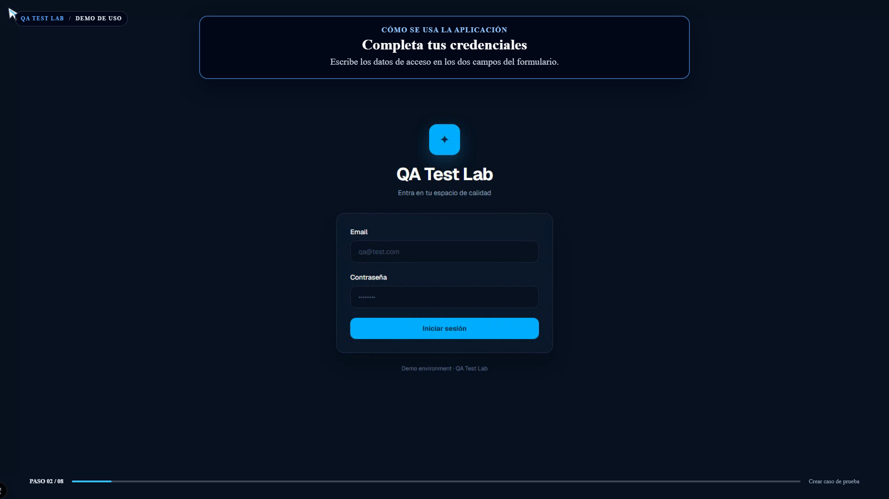
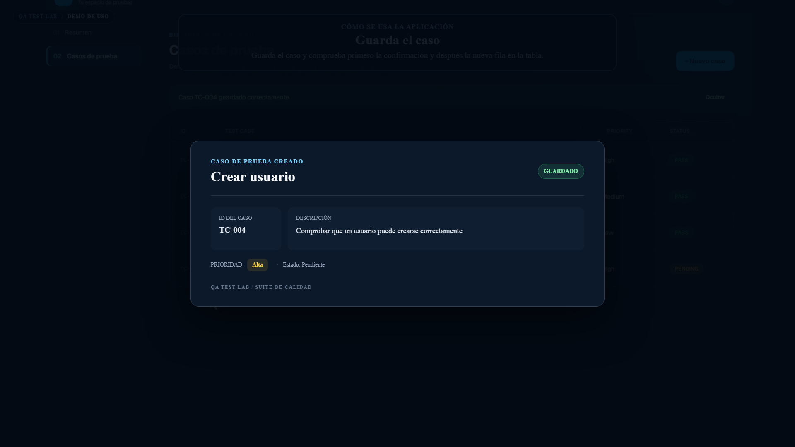

<div align="center">
	<h1>QA Test Lab</h1>
	<p><strong>Diseña casos. Explora flujos. Convierte pruebas reales en vídeo.</strong></p>
	<p>Un laboratorio visual para practicar QA de principio a fin, desde el primer clic hasta el MP4 final.</p>
	<p>
		
		
		
		
	</p>
	<p>
		<a href="#empezar">Empezar</a> ·
		<a href="#recorrido-en-video">Ver el flujo de vídeo</a> ·
		<a href="#documentacion">Documentación</a>
	</p>
</div>

---

## El laboratorio

QA Test Lab es una demo interactiva para recorrer tareas habituales de testing y enseñar cómo automatizarlas. La aplicación reúne un dashboard, una biblioteca de casos de prueba y un asistente conversacional simulado. Playwright graba recorridos reales en Chromium y Remotion los transforma en vídeos guiados.

| Área                | Qué puedes probar                                                                              |
| ------------------- | ---------------------------------------------------------------------------------------------- |
| **Casos de prueba** | Crear casos, asignar prioridad, buscar, filtrar, cambiar estados y revisar métricas.           |
| **Asistente QA**    | Explorar una conversación de ejemplo sobre escenarios de prueba. Las respuestas son simuladas. |
| **Vídeos QA**       | Grabar interacciones del navegador, medir pasos y renderizar tutoriales en MP4.                |

<p align="center">
	
	
</p>
<p align="center"><sub>Dos momentos del recorrido automatizado: acceso a la demo y creación de un caso.</sub></p>

## Empezar

Necesitas Node.js compatible con Next.js 16 y npm.

```bash
git clone https://github.com/AaronGalar/qa-test-lab-.git
cd qa-test-lab-
npm ci
npx playwright install
npm run dev
```

Abre [http://localhost:3000](http://localhost:3000). Para entrar en la demo:

| Campo      | Valor         |
| ---------- | ------------- |
| Email      | `qa@test.com` |
| Contraseña | `123456`      |

## Comandos

| Comando                   | Acción                                                                   |
| ------------------------- | ------------------------------------------------------------------------ |
| `npm run dev`             | Inicia la aplicación en modo desarrollo.                                 |
| `npm run build`           | Genera la compilación de producción.                                     |
| `npm run start`           | Sirve la compilación de producción.                                      |
| `npm run lint`            | Ejecuta ESLint.                                                          |
| `npx playwright test`     | Ejecuta la suite de pruebas; Playwright levanta Next.js automáticamente. |
| `npm run remotion`        | Abre Remotion Studio con las composiciones del proyecto.                 |
| `npm run record:tutorial` | Graba el recorrido de primer uso con Playwright.                         |
| `npm run render:tutorial` | Graba el recorrido y renderiza el tutorial completo.                     |
| `npm run render:ai-demo`  | Renderiza el vídeo de demostración del asistente.                        |
| `npm run render:qa`       | Renderiza el vídeo del caso TC-004.                                      |

## Recorrido en vídeo

El flujo combina tres piezas: Playwright ejecuta el escenario en Chromium, `tests/qa-metrics.ts` registra los tiempos y resultados de cada paso, y Remotion compone la grabación con rótulos sincronizados.

```text
Escenario Playwright → grabación WebM + métricas JSON → composición Remotion → MP4
```

Para generar el tutorial de primer uso:

```bash
npm run render:tutorial
```

La grabación fuente queda en `public/recordings/tutorial-ia.webm` y el vídeo final en `output/Tutorial-primer-uso.mp4`. Los vídeos y sus imágenes de vista previa están en `output/`; las grabaciones y datos de prueba, en `public/`.

## Estructura

```text
app/                  Pantallas de Next.js
tests/                Escenarios E2E y métricas QA
public/recordings/    Vídeos fuente de Playwright
public/test-data/     Resultados y tiempos por escenario
remotion/             Composiciones de vídeo
scripts/              Automatización de grabación y render
output/               MP4 y vistas previas generadas
docs/                 Guías de trabajo y creación de vídeos
```

## Documentación

- [Guía práctica para crear vídeos QA](docs/GUIA-CREAR-VIDEOS-QA.md)
- [Guía para modificar vídeos QA](docs/GUIA-TRABAJO-MODIFICAR-VIDEOS-QA.md)
- [Playbook de IA para vídeos QA](docs/PLAYBOOK-IA-VIDEOS-QA.md)

## Alcance de la demo

Este proyecto es un prototipo frontend: no conecta con una API ni una base de datos, y los cambios en los casos no persisten al recargar. El inicio de sesión y el asistente de IA también son simulaciones locales; las credenciales de arriba son exclusivamente para esta demo.
